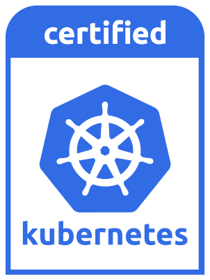

# What is Qbo?

> Designed for AI and ML.

Bare metal with the flexibility of the cloud, powered by QBO Kubernetes, excels in handling compute-intensive workloads demanding high performance and low latency, such as databases, AI/ML models, and various real-time applications. On the other hand, virtual machines (VMs) are well-suited for workloads that don't rely heavily on compute power and low latency, such as web servers, websites, and development environments. If your users' experience and your business success hinge on achieving high performance and low latency, leveraging bare metal for your Kubernetes clusters supported by QBO technology should be a strategic consideration.

> Pure containers

Qbo operates as a websockets API that oversees Docker in Docker Kubernetes clusters. In this unique setup, the traditional notion of a Kubernetes node, typically associated with a virtual or physical machine, is redefined as a container within the Qbo framework. Containerd runs within Docker in the Qbo environment, facilitating the deployment of an entire Kubernetes infrastructure as a self-contained process directly on the hardware.

> Metal Performance

This deployment method offers an instant boost in performance, leveraging direct access to all hardware resources, including CPU, memory, and disk. Tasks like cluster creation, deletion, starting, stopping, or scaling demonstrate remarkable speed compared to virtual machines. Qbo sustains the efficiency of metal performance while retaining the benefits of resource isolation through pure container technology.

> Native kernel functions

Administering a single kernel for each host, encompassing the Kubernetes nodes, offers a distinct advantage in terms of security, network, and storage operations. All tasks can be seamlessly executed through a unified interface—the Linux Kernel. Qbo harnesses these capabilities by utilizing native kernel features such as IPVS, netfilter, iproute2, and eBPF. Achieving observability and enhancing security becomes feasible by instrumenting a single kernel through eBPF.

> Unified API for Cloud Resources

Qbo operates as a Cloud API, overseeing not just Kubernetes clusters but also various [cloud components](#features). It boasts a high-performance Websockets API capable of real-time reporting on the status of Kubernetes nodes (represented as containers), pods, processes, and threads within the host. The data structure is formatted in JSON, and interactions are executed through commands.

> Real Time Observability

Due to the swift pace of operations, websockets are crucial for obtaining a real-time representation of the system's state. Qbo introduces the concept of 'mirrors,' serving as convergence points for websockets connections, allowing subscribers within the same 'mirror' to receive updates from pertinent systems. For instance, users connected to a 'mirror' monitoring Kubernetes 'pods' operations can observe real-time updates of such objects. Similarly, when a command is executed by a pthread or a process is generated in the system, these actions are immediately visible to all users within the mirror. As a result, Qbo delivers a unified API catering to all [cloud components](#features).

> Conformance

Qbo Kubernetes aligns with the Cloud Native Computing Foundation (CNCF) standards, ensuring adherence to best practices in cloud-native computing. This conformance establishes a solid foundation for scalability, interoperability, and performance, making Qbo Kubernetes a reliable choice for AI workloads.

Compatible with `Kind` images
[https://hub.docker.com/r/kindest/node/tags](https://hub.docker.com/r/kindest/node/tags)

<!-- > Latest QBO API Docker  images: https://hub.docker.com/repository/docker/eadem/qbo-api -->
# Kubernetes Engine

> Watch the video

# Features

?>
○ Multi cluster management 
○ Cluster scaling 

?>
○ Kubernetes 
■ Kubeconfig management 

?>
○ CNI 
■ kindnet 

?>
○ Persistent Storage 

?>
○ Registry 
■ Gitlab 
■ Docker Hub 
○ Images 
■ Kind Kubernetes image support 
■ Custom image support 

?>
○ Management 
■ Websockets API 
■ CLI 
■ Web interface 
■ Web terminal 

<!-- ■ Real Time logs 
■ Neural Graphs  -->

# Commands
|Command            | Argument                            | Options  | Paraemeter | Admin | Example                                                         |    Description               | 
|-------------------|-------------------------------------|----------|------------|-------|-----------------------------------------------------------------|------------------------------|
|  qbo add cluster  |    char[64]                         | -i     |  char[64]    |  N    | qbo add cluster `alex` -i `hub.docker.com/kindest/node:v1.27.2` | Add cluster                  |
|                   |                                     | -n     |  unsigned    |  N    |                                                                 | Number of nodes              |
|                   |                                     | -d     |  char[128]   |  N    |                                                                 | Domain name                  |
| qbo delete cluster|    char[64] |          |                                    |  N    | qbo delete cluster `alex`                                       | Delete cluster               |
|                   |                                     | -A     |              |  N    | qbo delete cluster -A                                           | Delete all clusters          |
| qbo stop cluster  |    char[64] |          |                                    |  N    | qbo stop cluster `alex`                                         | Stop cluster                 |      
|                   |                                     | -A     |              |  N    | qbo stop cluser -A                                              | Stop all clusters            |
| qbo start cluster |    char[64] |          |                                    |  N    | qbo start cluster `alex`                                        | Start cluster                |
|                   |                                     | -A     |              |  N    | qbo start cluster -A                                            | Start all clusters           |
| qbo get nodes     |    char[64] |          |                                    |  N    | qbo get nodes `alex`                                            | Get nodes                    |
|                   |                                     | -A     |              |  N    | qbo get nodes -A                                                | Get all nodes                |
|                   |                                     | -w     |              |  N    | qbo get nodes -w `43706dd0`                                     | Watch nodes                  |
| qbo get images    |    char[64] |          |                                    |  N    | qbo get images                                                  | Get node images              |
|                   |                                     | -A     |              |  N    | qbo get images -A                                               | Get all images               |
| qbo get cluster   |    char[64] |          |                                    |  N    | qbo get cluster `alex`                                          | Get cluster                  |
|                   |                                     | -A     |              |  N    | qbo get cluster -A                                              | Get all clusters             |
| qbo get network   |    char[64] |          |                                    |  N    | qbo get net `alex`                                              | Get cluster network          |
|                   |                                     | -A     |              |  N    | qbo get net -A                                                  | Get all cluster networks     |
| qbo get user      |                                     | -l     |              |  N    | qbo get user -l                                                 | Get local user configuration |
| qbo add node      |    char[64] |          |                                    |  N    | qbo add node `alex`                                             | Add node to cluster          |
|                   |                                     | -n     | unsigned     |  N    | qbo add node `alex` -n `3`                                      | Add n nodes to cluster       |
| qbo delete node   |    char[64] |          |                                    |  N    | qbo del node `node-2b251a2c`                                    | Delete node                  |
| qbo start node    |    char[64] |          |                                    |  N    | qbo start node `node-2b251a2c`                                  | Start node                   |
|                   |                                     | -A     |              |  N    | qbo start node -A                                               | Start all nodes              |
| qbo stop node     |    char[64] |          |                                    |  N    | qbo stop node `node-2b251a2c.localhost`                         | Stop node                    |
| qbo version       |    char[64] |          |                                    |  N    | qbo version                                                     | Get qbo version              |

